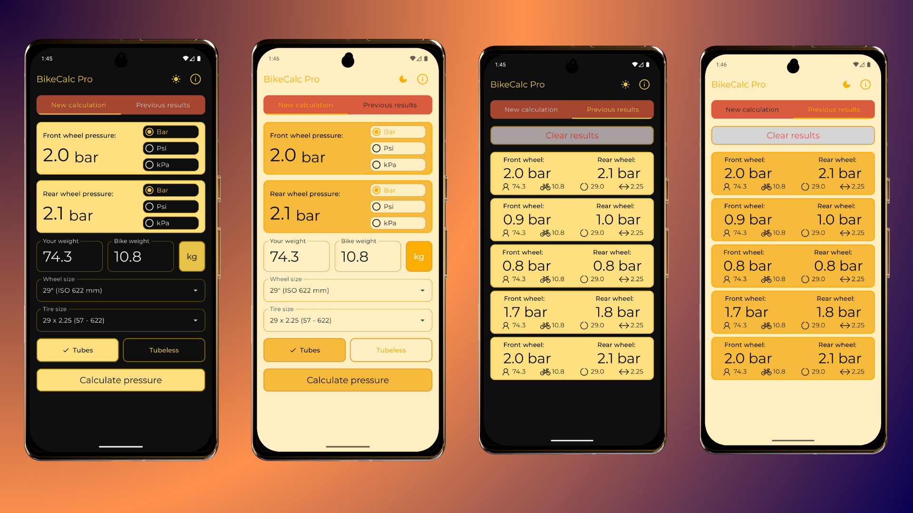

# 🚴‍♂️ BikeCalc Pro

<div align="center">



**Современное многоплатформенное приложение для велосипедистов**

*Демонстрация передовых подходов в разработке с использованием Kotlin Multiplatform и модульной архитектуры*

[](https://kotlinlang.org)
[](https://www.jetbrains.com/lp/compose-multiplatform/)
[](https://kotlinlang.org/docs/multiplatform-mobile-getting-started.html)
[](https://github.com/filin2hat/BikeCalcMP/actions/workflows/main.yml)

[](https://www.rustore.ru/catalog/app/dev.filinhat.bikecalc)
[](https://www.rustore.ru/catalog/app/dev.filinhat.bikecalc)

</div>

## 🎯 О проекте

**BikeCalc Pro** — это pet-проект, демонстрирующий современные подходы к разработке мультиплатформенных приложений. Проект реализует полнофункциональное приложение для велосипедистов с акцентом на **чистую архитектуру**, **модульность** и **масштабируемость**.

### 🏆 Ключевые достижения:
- ✅ **Опубликовано в RuStore** - рейтинг 5.0/5.0, 1000+ скачиваний
- ✅ **8-модульная архитектура** с четким разделением ответственности
- ✅ **Clean Architecture** с полным соблюдением SOLID принципов  
- ✅ **95%+ общего кода** между платформами
- ✅ **Автоматизированная CI/CD** с многоплатформенной сборкой
- ✅ **Инкрементальная компиляция** и параллельная сборка

## ⚡ Функциональность

- 📊 **Калькулятор давления в шинах** — интеллектуальный расчет с учетом всех параметров
- 📈 **Калькулятор развития** — расчёт метража и график по передаточным числам
- 📋 **История расчетов** — сохранение и управление результатами
- 🎨 **Адаптивный дизайн** — Material Design 3 с темной/светлой темой
- 🔄 **Мгновенная конвертация** единиц измерения (bar, psi, kPa)

## 🏗️ Архитектура

Проект построен на **многомодульной Clean Architecture** с четким разделением ответственности:

- 🏗️ **Core модули** - общая инфраструктура (model, common, database)  
- 🎯 **Domain модули** - бизнес-логика и интерфейсы (включая `pressure` и `development`)
- 💾 **Data модули** - реализация доступа к данным
- 🎨 **Feature модули** - UI и презентационная логика (`feature:pressure`, `feature:development`)
- 🎪 **Design System** - переиспользуемые UI компоненты

**[📖 Подробная документация архитектуры →](docs/ARCHITECTURE.md)**

## 🛠️ Технологический стек

- 🎨 **Compose Multiplatform** - единый UI код для всех платформ
- 🏛️ **Clean Architecture + MVVM** - чистая архитектура с четким разделением слоев  
- 💾 **Room + SQLite** - типобезопасная работа с базой данных
- ⚙️ **Coroutines + Flow** - реактивное асинхронное программирование
- 🔧 **Gradle Version Catalogs + KSP** - современные инструменты сборки

**[📖 Полный список технологий →](docs/ARCHITECTURE.md#-технологический-стек)**

## 📱 Поддерживаемые платформы

| Платформа | Статус | Особенности |
|-----------|---------|-------------|
| 🤖 **Android** | ✅ [Опубликовано в RuStore](https://www.rustore.ru/catalog/app/dev.filinhat.bikecalc) | Material Design 3, рейтинг 5.0/5.0 |
| 🍎 **iOS** | ✅ Полная поддержка | Native iOS navigation |  
| 💻 **Desktop** | ✅ Полная поддержка | Windows, macOS, Linux |

## 🚀 CI/CD Pipeline

Проект оснащен **полностью автоматизированной CI/CD** системой на GitHub Actions:

- 🧪 **Автоматическое тестирование** всех модулей
- 🏗️ **Параллельная сборка** для Android, iOS, Desktop  
- 📊 **Детальные отчеты** и артефакты сборки
- ✅ **Контроль качества** с помощью Detekt

**[📖 Подробнее о CI/CD →](docs/CI_CD.md)**

## 🚀 Быстрый старт

```bash
# Клонирование и запуск
git clone https://github.com/filin2hat/BikeCalcMP.git
cd BikeCalcMP
./gradlew :composeApp:run
```

**[📖 Полная инструкция по установке →](docs/SETUP.md)**

## 💼 Для рекрутеров

Этот проект демонстрирует **практические навыки Enterprise-разработки**:

- 🏗️ **Архитектурное мышление** - проектирование масштабируемых систем
- 💻 **Технические навыки** - владение современным стеком KMP
- 🛠️ **DevOps практики** - полная автоматизация CI/CD  
- 🎯 **Продуктовое мышление** - пользовательски-ориентированные решения

**[📖 Подробная информация для рекрутеров →](docs/FOR_RECRUITERS.md)**

## 🔮 Планы развития

- 🔧 **v2.0**: Калькулятор трансмиссии, экспорт в PDF
- 🚀 **v3.0**: Web платформа, ML предсказания, интеграция с IoT

## 👥 Контакты

**Разработчик**: Дмитрий Бирюлин  
**Email**: filin2hat@gmail.com  
**LinkedIn**: [www.linkedin.com/in/biryulindevelop](https://www.linkedin.com/in/biryulindevelop)  
**Telegram**: [@filin2hat](https://t.me/filin2hat)

---

<div align="center">

### ⭐ Star this repo если проект был полезен!

*"Чистый код — это не написанный, а переписанный код"*

</div>
