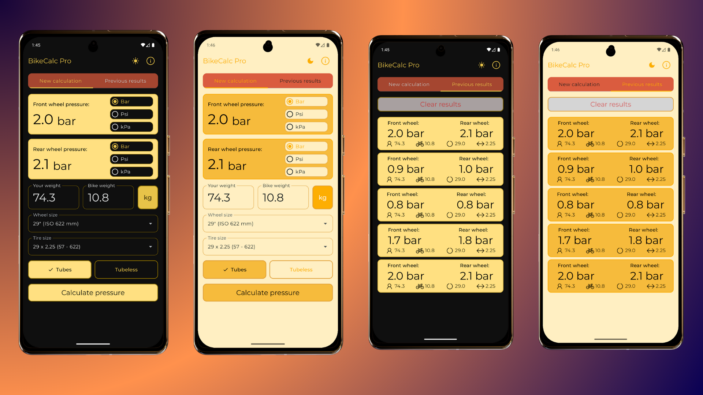

# 🚴‍♂️ BikeCalc Pro

<div align="center">



[](https://kotlinlang.org)
[](https://www.jetbrains.com/lp/compose-multiplatform/)
[](https://kotlinlang.org/docs/multiplatform-mobile-getting-started.html)
[](https://github.com/filin2hat/BikeCalcMP/actions/workflows/main.yml)

[](https://www.rustore.ru/catalog/app/dev.filinhat.bikecalc)
[](https://www.rustore.ru/catalog/app/dev.filinhat.bikecalc)

</div>

## 👓 О проекте

**BikeCalc Pro** — это мультиплатформенное приложение для велосипедистов, демонстрирующее
современные подходы к разработке. Проект реализует полнофункциональный инструмент с акцентом на *
*чистую архитектуру**, **модульность** и **масштабируемость**.

### 🎯 Цель проекта

Демонстрация навыков работы с современными технологиями (KMP, Compose Multiplatform, Clean
Architecture) и создание полезного инструмента для велосипедного сообщества.

### 🎯 Целевая аудитория

Райдеры любого уровня (MTB, шоссе, грэвел, город) и веломеханики.

### ⚡ Основные возможности

- **Калькулятор давления в шинах** — точный подбор с учётом веса, размера колеса и типа камеры
- **Калькулятор развития передач** — расчёт метража и графики по передаточным числам
- **Калькулятор передаточного соотношения** — анализ и сравнение передач
- **История расчётов** с мгновенной конвертацией единиц (bar/psi/kPa)

## ⬇️ Скачать

APK: [BikeCalc_Pro_4.3.0.apk](https://github.com/filin2hat/BikeCalcMP/releases/download/release4_3_0/composeApp-release.apk)

### 🏆 Ключевые достижения:

- ✅ **Опубликовано в RuStore** - рейтинг 5.0/5.0, 1000+ скачиваний
- ✅ **Мульти-модульная архитектура** с четким разделением ответственности
- ✅ **Clean Architecture** с полным соблюдением SOLID принципов
- ✅ **95%+ общего кода** между платформами
- ✅ **Автоматизированная CI/CD** с многоплатформенной сборкой
- ✅ **Инкрементальная компиляция** и параллельная сборка
- ✅ **Compose Hot Reload** - ускорение разработки UI

## ⚡ Функциональность

- 📊 **Калькулятор давления в шинах** — интеллектуальный расчет с учетом всех параметров
- 📈 **Калькулятор развития** — расчёт метража и график по передаточным числам
- 📋 **История расчетов** — сохранение и управление результатами
- 🎨 **Адаптивный дизайн** — Material Design 3 с темной/светлой темой
- 🔄 **Мгновенная конвертация** единиц измерения (bar, psi, kPa)

## 🏗️ Архитектура

Проект построен на **многомодульной Clean Architecture** с четким разделением ответственности:

- 🏗️ **Core модули** - общая инфраструктура (model, common, database)
- 🎯 **Domain модули** - бизнес-логика и интерфейсы (включая `pressure` и `development`)
- 💾 **Data модули** - реализация доступа к данным
- 🎨 **Feature модули** - UI и презентационная логика (`feature:pressure`, `feature:development`)
- 🎪 **Design System** - переиспользуемые UI компоненты

**[📖 Подробная документация архитектуры →](docs/ARCHITECTURE.md)**

## 🛠️ Технологический стек

- 🎨 **Compose Multiplatform** - единый UI код для всех платформ
- 🏛️ **Clean Architecture + MVVM** - чистая архитектура с четким разделением слоев
- 💾 **Room + SQLite** - типобезопасная работа с базой данных
- ⚙️ **Coroutines + Flow** - реактивное асинхронное программирование
- 🔧 **Gradle Version Catalogs + KSP** - современные инструменты сборки
- 🔥 **Compose Hot Reload** — мгновенное обновление UI без перезапуска (встроено в CMP 1.10+)

**[📖 Полный список технологий →](docs/ARCHITECTURE.md#-технологический-стек)**

## 📱 Поддерживаемые платформы

| Платформа      | Статус                                                                               | Особенности                        |
|----------------|--------------------------------------------------------------------------------------|------------------------------------|
| 🤖 **Android** | ✅ [Опубликовано в RuStore](https://www.rustore.ru/catalog/app/dev.filinhat.bikecalc) | Material Design 3, рейтинг 5.0/5.0 |
| 🍎 **iOS**     | ✅ Полная поддержка                                                                   | Native iOS navigation              |  
| 💻 **Desktop** | ✅ Полная поддержка                                                                   | Windows, macOS, Linux              |

## 🚀 CI/CD Pipeline

Проект оснащен **полностью автоматизированной CI/CD** системой на GitHub Actions:

- 🧪 **Автоматическое тестирование** всех модулей
- 🏗️ **Параллельная сборка** для Android, iOS, Desktop
- 📊 **Детальные отчеты** и артефакты сборки
- ✅ **Контроль качества** с помощью Detekt

**[📖 Подробнее о CI/CD →](docs/CI_CD.md)**

## 📊 Мониторинг производительности

Проект использует **[Kotzilla](https://kotzilla.io/)** для мониторинга производительности и
аналитики:

- 🔍 **Визуализация графа зависимостей** Koin в Android Studio/IntelliJ
- 🚀 **Отслеживание времени запуска** приложения
- 📱 **Мониторинг производительности** на всех устройствах в продакшене
- 🔄 **Автоматическое отслеживание** без ручной инструментации
- 📈 **Анализ производительности** модульной архитектуры

**Конфигурация:**

- Файл конфигурации: `composeApp/kotzilla.json`
- Автоматическая генерация ключей: `composeApp/src/main/assets/kotzilla.key`
- Инициализация: `composeApp/src/commonMain/kotlin/dev/filinhat/bikecalc/di/InitKoin.kt`

**[📖 Подробная документация по Kotzilla →](docs/KOTZILLA.md)**

## 🚀 Быстрый старт

```bash
# Клонирование и запуск
git clone https://github.com/filin2hat/BikeCalcMP.git
cd BikeCalcMP
./gradlew :composeApp:run
```

**[📖 Полная инструкция по установке →](docs/SETUP.md)**

## 🔥 Compose Hot Reload

**Compose Hot Reload** встроен в Compose Multiplatform 1.10.0+ — отдельное подключение не требуется.
Мгновенное обновление UI без перезапуска приложения:

```bash
# Запуск desktop-приложения с Hot Reload
./gradlew :composeApp:hotRunDesktop
```

**Использование:** измените код в `commonMain` → сохраните файл (Ctrl+S) → UI обновится автоматически.

- ⚡ Мгновенное обновление UI при сохранении
- 🔄 Сохранение состояния приложения
- 🎨 Поддержка Compose компонентов и ViewModels

**[📖 Подробная документация по Hot Reload →](docs/HOT_RELOAD.md)**

## 📚 Документация

### 🏗️ Архитектура и разработка

- **[🏗️ Архитектура проекта](docs/ARCHITECTURE.md)** - модульная структура, технологический стек
- **[🚀 Установка и запуск](docs/SETUP.md)** - полная инструкция по настройке окружения
- **[🛠️ Инструменты разработки](docs/DEVELOPMENT_TOOLS.md)** - LeakCanary, Detekt, KSP, Kotzilla
- **[🔥 Hot Reload](docs/HOT_RELOAD.md)** - ускорение разработки UI

### 🚀 CI/CD и развертывание

- **[⚙️ CI/CD Pipeline](docs/CI_CD.md)** - автоматизация сборки и развертывания
- **[📊 Kotzilla Analytics](docs/KOTZILLA.md)** - мониторинг производительности

### 🎯 Для разработчиков

- **[📋 История версий](docs/versoins_history.md)** - changelog проекта
- **[🔧 Диаметры колес](docs/for_develop/wheel_diametrs.md)** - справочная информация

## 💼 Для рекрутеров

Этот проект демонстрирует **практические навыки Enterprise-разработки**:

- 🏗️ **Архитектурное мышление** - проектирование масштабируемых систем
- 💻 **Технические навыки** - владение современным стеком KMP
- 🛠️ **DevOps практики** - полная автоматизация CI/CD
- 🎯 **Продуктовое мышление** - пользовательски-ориентированные решения

**[📖 Подробная информация для рекрутеров →](docs/FOR_RECRUITERS.md)**

## 🔮 Планы развития

- 🔧 **v5.0**: Калькулятор трансмиссии, экспорт в PDF
- 🚀 **v6.0**: Web платформа, ML предсказания, интеграция с IoT

## 👥 Контакты

**Разработчик**: Дмитрий Бирюлин  
**Email**: filin2hat@gmail.com  
**LinkedIn**: [www.linkedin.com/in/biryulindevelop](https://www.linkedin.com/in/biryulindevelop)  
**Telegram**: [@filin2hat](https://t.me/filin2hat)

---

<div align="center">

### ⭐ Star this repo если проект был полезен!

*"Чистый код — это не написанный, а переписанный код"*

</div>
